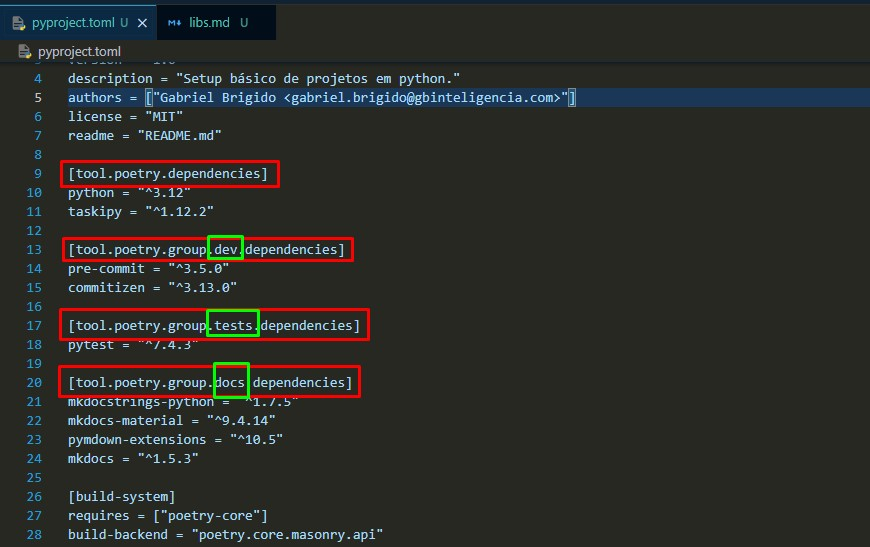
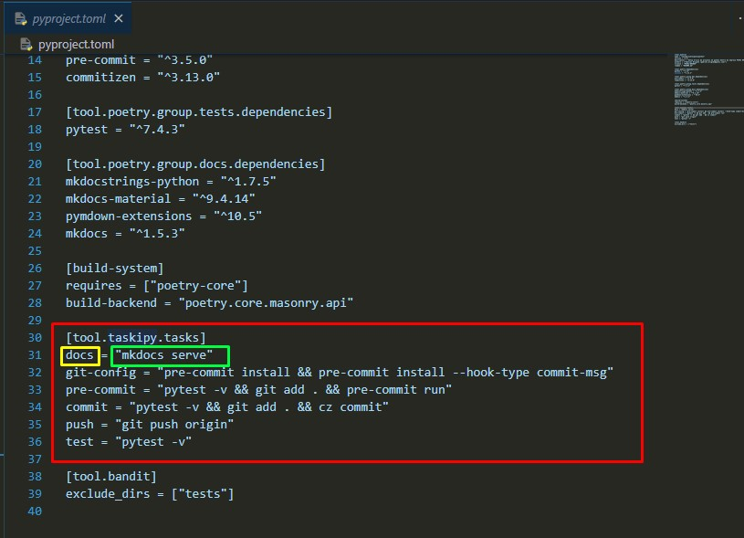
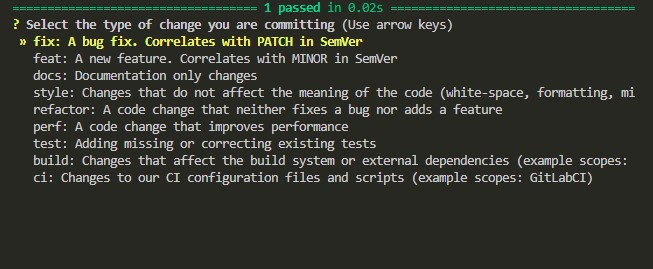

# Bibliotecas padrão deste projeto
Para garantir os padrões de clean code e facilitar a vida do desenvolvedor no ciclo de desenvolvimento de projetos foram elencados algumas bibliotecas padrão, esta página irá descreve-las.

## Pyenv
Conforme vamos avançando no desenvolvimento de projetos é normal o python avançar e lançar novas versões da linguagem. Este programa facilita a adiministração de várias versões do python na sua máquina de maneira simples e dinâmica, consulte a documentação [aqui](https://github.com/pyenv/pyenv).

### Instalação
Instalar o pyenv no windows pode ser algo complicado, siga [este tutorial](https://www.youtube.com/watch?v=HTx18uyyHw8) para facilitar o setup.

### Utilização
Você precisa dominar apenas alguns comandos do pyenv:

- Listar todas as versões disponíveis ja lançadas do python:
```bash
pyenv install -l
```

- Instalar versão do python:
```bash
pyenv install <numero-da-versao-desejada>
```

- Consultar versões do python instaladas na sua máquina:
```bash
pyenv versions
```

- Atribuir versão específica do python em um projeto (execute dentro do diretório do projeto):
```bash
pyenv local <numero-da-versao-desejada>
```

    !!! tip "Setando versão por projeto"
        Esse comando cria um arquivo `.python-version` dentro da raiz do seu projeto, utilize sempre esse comando para seu projeto ser executado na versão correta do python.

## Poetry
O Poetry é uma biblioteca de gerenciamento de dependências e ambientes virtuais do python, utilize ele como base para suas instalações de pacotes do seu projeto. A documentação do Poetry pode ser acessada [aqui](https://python-poetry.org/docs/).

### Instalação
Você pode utilizar o `pip` para instalar o poetry na versão do python que você está utilizando:
```bash
pip install poetry
```

!!! warning "Pyenv + Poetry"
    Caso você não opte por uma instalação global do Poetry, você precisará executar o comando acima para cada versão do python que você instalar com o Pyenv. As configurações do Poetry (que você verá a seguir) são globais por padrão.

### Configuração
É necessário realizar algumas configurações no poetry para a melhor execução dos seus projetos:

- Criar os ambientes virtuais dentro do seu projeto:
```bash
poetry config virtualenvs.in-Project true
```

- Identificar qual versão do Python está ativada para o projeto:
```bash
poetry config virtualenvs.prefer-active-python true
```

### Utilização
O Poetry utiliza por padrão um arquivo de configuração chamado `pyproject.toml` ele é a base do projeto, ele armazena os meta-dados do projeto, quais bibliotecas ele utiliza, automações e "skips" do projeto.

#### Entendendo as seções
O arquivo `pyproject.toml` funciona como um `requirements.txt` com esteróides, ele é mais organizado, e no mesmo arquivo você pode separar suas bibliotecas por grupos de instalação, o que é de uma imensa ajuda quando vamos fazer deploy em produção.

Cada "parte" do arquivo é denominada "seção", cada seção é declarada com um título que fica entre colchetes e é responsável por um atributo do porjeto. Segue exemplo de seções de dependências deste projeto:

> Cada destaque em vermelho é uma seção, neste caso cada seção corresponde a uma categoria de dependências, desenvolvimento, testes e documentação, respectivamente.

#### Adicionando bibliotecas
Você pode utilizar o Poetry para adicionar bibliotecas e frameworks de uma forma mais elegante, e de diversas formas:

!!! info "Caso de exemplo"
    Usaremos como exemplo de instalação a biblioteca [polars](https://pola-rs.github.io/polars/py-polars/html/reference/).

- Adicionar o `polars` nas dependencias principais do projeto:
```bash
poetry add polars
```

- Adicionar o `polars` em uma seção específica de dependencias:
```bash
poetry add polars --group <id-do grupo>
```
>Exemplo:
```bash
poetry add polars --group dev   #Adiciona o polars na seção de desenvolvimento do pyproject.toml
```

#### Instalando o `pyproject.toml`
Com o pyproject no seu projeto, você pode instalar as bibliotecas do seu projeto de maneira simples:

!!! info "Ambientes virtuais"
    Por padrão, o Poetry **SEMPRE** criará um ambiente virtual para instalar as bibliotecas.

- Instalar **TODAS** as dependências do seu projeto:
```bash
poetry install --no-root
```

Você também pode instalar as bibliotas de cada seção individualmente:

- Instalar somente as bibliotecas da seção `dev`:
```bash
poetry install --no-root --with dev
```

Ou então ignorar as bibliotecas de uma determinada seção:

- Instalar as as bibliotecas do projeto **EXCETO** as bibliotecas da seção `dev`:
```bash
poetry install --no-root --without dev
```

#### Entrando no ambiente virtual para desenvolvimento
Após instalar as bibliotecas do seu projeto, basta executar um comando para ativar o ambiente virtual:

```bash
poetry shell
```

## Taskipy
Esta é uma lib de abstração de comandos, você declara o comando no `pyproject.toml` e ele traduz isso para um comando do terminal. Documentação [aqui](https://github.com/taskipy/taskipy).

Você pode declarar o comando na seção `[tool.taskipy.tasks]`:

>Dentro da seção destacada em vermelho você pode escrever o nome do comando que você deseja chamar (destaque amarelo), e então qual comando o Taskipy vai executar (destaque verde).

Agora pra chamar cada comando cadastrado você pode usar função `task`:

```bash
task <nome-do-comando-no-pyproject>
```

Desta forma, ao executar o comando:

```bash
task docs
```

O comando executado no shell será:

```bash
mkdocs serve
```

!!! tip "Automatização"
    Utilize o `Taskipy` sempre que possível para automatizar suas rotinas!


## Mkdocs
Esta Biblioteca é a documentação dos nossos projetos aqui na Pavei, é com base nela que você está lendo esta documentação!

Se quiser se aprofundar mais, leia a documentação [aqui](https://www.mkdocs.org/getting-started/).

## Pre-commit e Commitizen
Estas libs garantem a coesão e boas práticas no nosso código, juntas elas facilitam a documentação, o versionamento do código e garante que outro usuário consiga continuar no trabalho com qualidade.

### Pre-commit
Esta lib cadastra os `hooks` que determinam quais as premissas que o código precisa seguir antes de ser commitado na branch.

Os hooks do projeto podem ser encontrados em `.pre-commit-config.yaml`.

!!! danger "Pre-commit"
    Utilize as orientações do Pre-commit **SEMPRE**, assim garantimos que o melhor código está subindo para a produção. Nossos processos dependem disso!

### Commitzen
O [Commitzen](https://commitizen-tools.github.io/commitizen/) é uma biblioteca que transforma os commits básicos do git em `commits semânticos`.

Ao finalizar seu desenvolvimento você pode executar o comando:
```bash
task commit
```


Assim, ao invés de uma mensagem simples ao commitar, o desenvolvedor precisará descrever algumas características adicionais do seu commit:

- O tipo de mudança que vocês está realizando no código:


- Quais arquivos foram alterados
- Um breve resumo do que foi alterado
- Uma descriçao um pouco mais detalhada do que foi modificado

A pós isso o sistema irá realizar a avaliação do seu commit e, se estiver tudo ok, seu código será commitado na sua branch.

!!! tip "Ativando Pre-commit e Commitzen"
    Para ativar as regras de Pre-commit e o commitzen utilize o seguinte comando:
    ```bash
    task git-config
    ```
    Agora seu projeto exigirá que seu código passe pelas regras de pre-commit e que você utilize commits semâticos.
