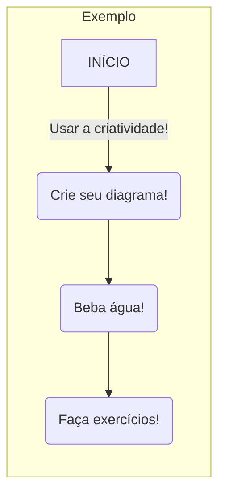

# Estruturando corretamente a documentação

## Conteúdo da documentação
Para a documentação ser clara e objetiva na intenção de informar como seu projeto funciona ela precisa ter alguns pontos importantes:

- **README.md** - O projeto precisa ter um arquivo que oriente como o usuário deve fazer o setup inicial do projeto para rodar o mesmo na sua máquina
- **Layout do projeto** - A documentação precisa apresentar um template de como os arquivos do projeto estão dispostos, bem como uma breve descrição de cada arquivo (pode-se utilzar das docstrings)
- **Fluxo de Processo** - É necessário apresentar um diagrama do fluxo de processo do seu projeto, seja ele um pipeline, uma automação, etc.. é importante até para exemplificar o projeto para usuários não técnicos
- **Detalhamento do código** - Em projetos mais complexos pode se fazer necessário descrever com mais clareza as funções, classes, métodos ou atributos utilizados no desenvolvimento, dessa maneira vc precisará apontá-los também na documentação

!!! tip "Documentando código"
    Mantenha as `docstrings` do seu projeto estruturadas corretamente para que a lib `mkdocstrings` possa puxar seu código de maneira automática para a documentação! (Mais detalhes na seção de dicas!)

## Dicas de documentação
Para facilitar a construção de uma documentação clara e objetiva, você pode utilizar algumas libs ja inclusas nesse projeto!

### Mermaid
O `Mermaid` é uma linguagem de marcação básica baseada em `JavaScript` que permite que você crie diagramas fácilmente em arquivos .md!

> Exemplo:

    ```mermaid
        flowchart LR
            subgraph pipeline[Exemplo]
                A[INÍCIO] --> |Usar a criatividade!| B(Crie seu diagrama!)
                B --> C(Beba água!)
                C --> D(Faça exercícios!)

        end
    ```

> Resultado:


Você também pode utilizar outros tipos de formatos de diagramas! Consulte a documentação do Mermaid [aqui](https://mermaid.js.org/intro/).

!!! tip "Testando diagramas"
    O mermaid também possui um site onde você pode criar seus diagramas em tempo real! Acesse [aqui](https://mermaid.live/).

### Admonition
O admonition é um jeito elegante de adicionar informações na sua documentação!

> Exemplo:

    !!! tip "Crie Dicas!"
        Este tipo de insert facilita a orientação dos usuários!

> Resultado:

!!! tip "Crie Dicas!"
    Este tipo de insert facilita a orientação dos usuários!

Existem vários tipos de inserts com admonition que podem ser utilizados! Consulte [aqui](https://squidfunk.github.io/mkdocs-material/reference/admonitions/) a documentação para saber mais!

### Mkdocstrings
O mkdocstrings é um jeito fácil de documentar seu código referenciando ele diretamente da fonte! basta apontar o caminho do código e o plugin exibe um display completo do seu código

> Exemplo:

    ::: tests.unity_test    #Referenciando o arquivo de testes unitários localizado em: tests/unity_test.py

> Resultado:

#### ::: tests.unity_test

!!! warning "Padronizando docstrings"
    O `mkdocstrings` utiliza as suas declarações de docstrings nas funções para montar a documentação, declare corretamente os argumentos e retornos nas funções para criar uma documentação mais coesa.
