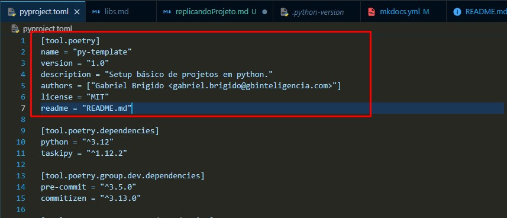

# Replicar o projeto

Se os métodos que eu utilizo fizerem sentido com o seu dia a dia e seus desenvolvimentos, você pode utilizar este repositório como base de seus projetos futuros!

## Utilizando este repositório como base

Basicamente você pode reutilizar esse repositório de duas formas:

- Criando um fork deste repositório
- Clonando este repositório para sua máquina e iniciando um novo projeto a partir dele

!!! warning "Utilizando a segunda opção"
    Caso prefira clonar este repositório tenha em mente que você irá precisar seguir alguns passos adicionais:

    - Ao clonar o repositório, apagar a pasta `.git` e então utilizar o comando `git init` para criar um novo track dos seus arquivos
    - Vincular o repositório local com o seu repositório remoto correspondente

!!! tip "Lembre-se de renomear seu projeto!"
     Você deve alterar os dados referentes ao seu projeto dentro da seção `[tool.poetry]` do arquivo `pyproject.toml`:

    
